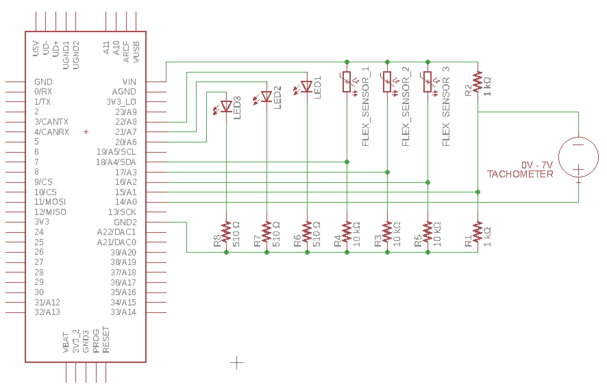

# Electronica Dextris

Have you ever heard of a Hurdy Gurdy?

Have you ever heard of an _electronic_ Hurdy Gurdy

Well here's the code that powers ours

## The instruemnt

The instrument is controlled with a Teensy 3.5

### Schematic

The schematic for this is shown below

We used 1 inch Flex sensors and a 0 - 7V Tachometer for the sensors

### Code
The code for this is done through [Teensyduino](https://www.pjrc.com/teensy/teensyduino.html),
so the underlying code is written in `.ino` files.

Once Teensyduino is installed make sure you set the USB type to Midi (`tools > USB type > MIDI`)
Then it can be directly flashed onto your board

#### Midi

The Midi messages sent are

| Description | Midi Message | Value |
|--------|--------|------|
| Note Off | Note Off | Flex sensor not deflected |
| Note On | Note On | Flex sensor deflected |
| Pitch bend | CC 2 (breath) | Flex sensor _super_ deflected |
| Volume | CC 7 (volume) | current Tachometer rotation |
| Trompette | CC 11 (expression) | Tachometer rotating fast | 

## Web
This web interface is written in react and controls a dashboard that emits midi messages
 to somewhere

Looking back, This probably isn't the right way to do stuff and the connection should be done
over serial so all the midi can be handled by the teensy.  ¯\\\_(ツ)\_/¯

